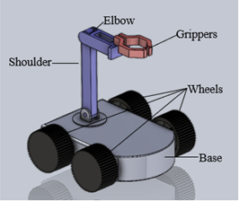
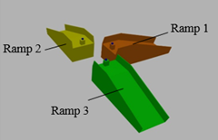

# Differential Drive Mobile Manipulator (4-Wheel, 2-DOF)

This repository contains the simulation framework for the mobile manipulator robot presented in the IEEE conference paper:

**Design and Implementation of a Differential Drive Manipulator Robot for Industrial Pickup and Sorting Applications Using ROS2**  
Adithya Pothula, Medhini V, Hamna Hakkim, Rajesh Kannan Megalingam  
International Conference on Robotics and Mechatronics (ICRM), 2025

The work demonstrates the design, modelling, and simulation validation of a differential-drive mobile manipulator for industrial pick-and-place and sorting tasks. The system was designed in SolidWorks, represented using URDF, and evaluated in a ROS2–Gazebo simulation environment prior to hardware realization.

---

## Robot Design

### SolidWorks Model

The robot consists of a differential-drive base and a lightweight 2-DOF manipulator optimized for industrial material handling and sorting operations.

---

### Simulation Environment

The Gazebo simulation environment was configured to evaluate:

- robot mobility and stability  
- teleoperation performance  
- interaction with industrial objects  
- navigation over ramps and uneven surfaces  

---

### URDF Structure

The URDF model represents the full kinematic chain of the mobile manipulator, including base, joints, links, and end-effector, enabling physics-based validation in simulation.

---

## Repository Contents

This repository includes:

- URDF robot model and configuration  
- Gazebo world and simulation setup  
- ROS2 launch files for robot spawning and control  
- Teleoperation and interaction configuration  

These elements correspond to the simulation framework described in the published work.

---

## External Dependency

This project uses the Boeing Gazebo Model Attachment Plugin.

Repository link:

https://github.com/boeing/gazebo_model_attachment_plugin

The plugin is included as a submodule and is required for attaching and manipulating objects dynamically within the Gazebo simulation.

---

## Citation

If you use this repository, simulation setup, or design concepts in academic work, please cite:

A. Pothula, V. Medhini, H. Hakkim, and R. K. Megalingam,  
"Design and Implementation of a Differential Drive Manipulator Robot for Industrial Pickup and Sorting Applications Using ROS2,"  
2025 International Conference on Robotics and Mechatronics (ICRM).

---

## Authors

Adithya Pothula  
Medhini V  
Hamna Hakkim  
Rajesh Kannan Megalingam  

---

## Notes

This repository is preserved as an archival reference for the published research.  
Further extensions or derivative systems may exist in separate repositories.
